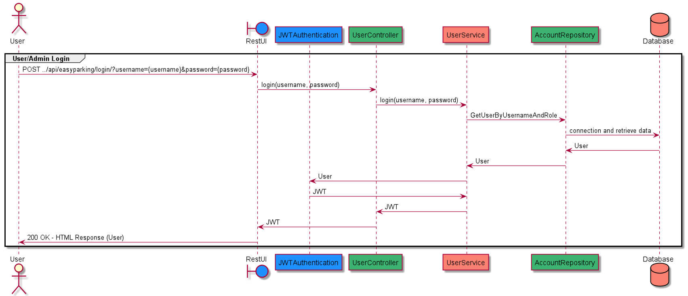

# Easy Parking

### Introduzione
Il seguente progetto presenta lo sviluppo di un’applicazione server side pensata per la corretta gestione interna
delle zone di parcheggio nelle aree urbane.
Nel dettaglio, verte sulla prenotazione a distanza di un posteggio per veicoli di diversa natura,
negli spazi riservati a tale scopo. Al fine di comprenderne meglio l’utilità, si riportano di seguito,
alcune delle sue funzionalità.
Previa registrazione dell’utente, consente l’individuazione delle aree di parcheggio all’interno di
una specifica città con semplice indicazione della disponibilità di un posto auto. Individuato il
posteggio, per la sua prenotazione, si procede con il pagamento digitale del ticket, la cui tariffa viene
determinata in base alla colorazione delle strisce e al tempo che si desidera sostare.
La corretta esecuzione di tale procedimento permette, inoltre, una più efficace amministrazione delle
aree di parcheggio da parte della polizia locale.
In conclusione, l’applicazione in questione ha il doppio obiettivo di facilitare il conducente nella ricerca di un
adeguato posteggio per il proprio veicolo, in grado di soddisfare meglio le sue esigenze ottimizzando
i tempi, nonché, grazie al sostegno della digitalizzazione, si presta come valido aiuto per le guardie
municipali incaricate della conduzione del traffico urbano.

### Analisi dei requisiti e funzionalità
Le sue funzionalità si suddividono in 3 categorie:
 - _**Pubbliche**_
 - _**Utente**_
 - _**Amministratore**_

Le funzionalità _**pubbliche**_ sono:
 - La login sia di un utente che di un amministratore, necessaria per effettuare l'accesso al proprio account e alla propria area riservata (dati personali, informazioni e servizi)
 - La sign up per fornire l'interfaccia con utenti non ancora registrati/autenticati mediante compilazione dei propri dati (nome, cognome, email e password)
 - La Forgot Password, che in caso di dimenticanza della stessa, sia l’utente, sia l'amministratore ne ricevono in modo immediato una nuova
   
Le funzionalità _**utente**_ sono:
 - Cambio password
 - Ricerca delle aree di sosta disponibili, sulla base di svariati filtri che l'utente può attribuire quali:
   - luogo di destinazione
   - funzionalità dell'area di sosta (Car, HandicapCar, ElectricCar, Bus, Camper, Roulette, Motorcycle, LoadingAndUnloadingZone)
   - colorazione delle strisce delle aree di sosta (White, Blue, Yellow, Pink, Green) ognuna con una tariffa ben precisa
   - dimensione e tipologia della zona di posteggio (Nastro, Spina, Pettine)
   - veicolo da parcheggiare
 - Caricamento d'immagini della propria patente
 - Download delle immagini della propria patente
 - Aggiunta di veicoli
 - Visualizzazione di:
   - Profilo utente
   - Veicoli aggiunti che possono essere scelti per semplificare la ricerca
   - Modelli di veicolo, che saranno attribuiti all'aggiunta di un veicolo in modo tale da conoscerne le dimensioni 
   - Le colorazioni delle strisce e le relative tariffe orarie/giornaliere/settimanali/mensili
   - Le tipologie e le dimensioni delle aree riservate ai parcheggi
   - Ticket generati
   - Eventuali multe (pagate/non pagate)
 - Generazione di un ticket con relativa prenotazione dell'area di sosta
 - Pagamento dei ticket
 - Pagamento di eventuali multe
 
Le funzionalità _**amministratore**_ (Membro della Polizia Locale) sono:
  - Caricamento d'immagini del proprio tesserino
  - Download delle immagini del proprio tesserino
  - Inserimento/aggiornamento/rimozione di una colorazione di strisce
  - Inserimento/aggiornamento/rimozione di un'area di sosta
  - Inserimento/aggiornamento/rimozione di una nuova tariffa (oraria/giornaliera/settimanale/mensile)
  - Gestione stalli con componentistica IoT danneggiata
  - Inserimento/aggiornamento di multe
  - Visualizzazione di:
    - Profilo amministratore
    - Utenti
    - Amministratori
    - Multe di un certo utente
    - Aree di sosta
    - Colorazioni di strisce delle aree di sosta
    - Tipologie e dimensioni delle aree di sosta

### API e Documentazione Swagger

Sono state sviluppate svariate API, affinché tutte le funzionalità vengano implementate.
É possibile visualizzare la loro documentazione al seguente link: [Documentazione EasyParking Swagger](https://app.swaggerhub.com/apis/comar_16/EasyParking/1.0.0)

### Schema ER DataBase
Il servizio di database scelto per EasyParking è MySql, il quale permette la gestione di un database relazionale.
Quello in questione è composto dalle seguenti tabelle:

 - Account: tutte le informazioni riguardante ogni singolo account tra cui credenziali, ruolo (User/Admin) ed eventuali dati di reset password
 - User: tutte le informazioni riguardante ogni singolo utente tra cui anagrafica e stato (Approved, Rejected, Pending)
 - License: tutte le informazioni sulla patente inserita dall'utente
 - Admin: tutte le informazioni riguardante ogni singolo amministratore tra cui anagrafica e stato (Approved, Rejected, Pending)
 - PoliceCard: tutte le informazioni sul tesserino delle forze dell'ordine
 - Ticket: tutte le informazioni sui ticket generati tra cui prezzo totale e scadenza
 - Fine: tutte le informazioni sulle multe tra cui punti da rimuovere, prezzo totale e scadenza
 - PaymentInfo: tutte le informazioni sui pagamenti
 - ParkingArea: tutte le informazioni sulle aree di sosta tra cui colorazione strisce, dimensione, tipo e stato (Free, Busy, Damaged, Deleted) 
 - ParkingAreaColor: tutte le informazioni sulla colorazione delle strisce e le relative tariffe
 - ParkingAreaTypeDimension: tutte le informazioni su dimensioni e tipi delle aree di sosta
 - Vehicle: tutte le informazioni sui veicoli inseriti dall'utente e relativa targa
 - ModelVehicle: tutte le informazioni sui vari modelli di veicoli disponibili
 

### Use Case Diagram
Sulla base delle funzionalità descritte precedentemente sono stati creati degli Use Case Diagram disponibili in ./UseCaseDiagram/ nei formati .puml e .png, i quali
descrivono le funzioni o servizi offerti dal sistema, così come sono percepiti e utilizzati dagli attori che interagiscono col sistema stesso
nei seguenti 3 casi d’uso:

- Funzionalità pubbliche
- Funzionalità utente
- Funzionalità amministratore
#### Funzionalità pubbliche

#### Funzionalità utente

#### Funzionalità amministratore

### Sequence Diagram
Sono stati creati dei Sequence Diagram disponibili in ./SequenceDiagram/ nei formati .puml e .png. Questi, descrivono la successione di operazioni
e messaggi di risposta tra i vari componenti dell’intero sistema, nei seguenti 3 casi d’uso:

 - Login
 - Aggiunta veicolo
 - Pagamento multa
#### Login

#### Aggiunta veicolo

#### Pagamento multa

### Struttura del codice
- Linguaggio di programmazione: Java
- Framework: Spring Boot
- Realizzazione dei package seguendo il modello:
    - configuration (configurazioni d'interfaccia con DataBase, MailTrap e PayPal)
    - controller (gestione delle richieste, chiamando i metodi dai vari services)
    - entity (vero e proprio mapping delle tabelle del DataBase)
    - repository (gestione delle query)
    - security (gestione dell'autenticazione)
    - service (insieme di metodi pronti a svolgere operazioni)
    - utils (modelli specifici di request, response e regex)

### Piano di Testing

I tests implementati si articolano in:

* Test per i Service: per controllare le operazioni svolte dai vari metodi
    * Test per le operazioni pubbliche
    * Test per le operazioni dell'utente
    * Test per le operazioni dell'amministratore
* Test per i Controllers: per verificare gli end points e lo status code restituito
    * Test per il Controller pubblico
    * Test per il Controller utente
    * Test per il Controller amministratore
  
#### Rapporto sull'andamento dei test

I log del successo dei test sono visualizzabili al seguente link: [Tests Result EasyParking](./TestResults-EasyParking.pdf)

### Ipotetici miglioramenti futuri

Il sistema server side attualmente non predispone di:
- un servizio di chat tra clienti e assistenza
- una gestione di suddivisione tariffaria Comunale
- la creazione di nuovi amministratori (membri della polizia locale) approvati dagli stessi

Le funzioni sopra elencate fungono da possibili migliorie realizzabili per il perfezionamento dell’esperienza utente.